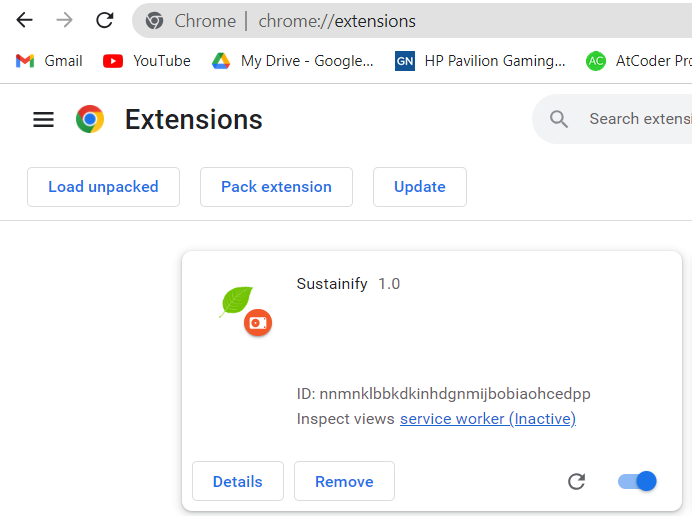
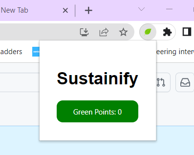

# Chrome extension

## Description

This is a browser extension that provides sustainability ratings for products on websites. It helps users make informed choices by displaying the environmental impact of products and calculating their green points.

## Installation

1. Download the extension package(sustainify folder) from the chrome-extension branch.
2. Extract the contents of the package to a local directory.
3. Open your browser and navigate to the extension management page:
   - For Google Chrome: Go to `chrome://extensions/`
4. Enable the "Developer mode" option if not already enabled.
5. Click on "Load unpacked" and select the extracted extension folder.
6. The extension should now be installed and ready to use.

## Usage

1. Browse the supported website (https://lucky-gumdrop-70ee17.netlify.app/).
2. The extension will automatically display the sustainability ratings for each product, indicating their environmental impact.
3. Interact with the products as usual, and the extension will keep updating the sustainability ratings.
4. Click on the extension's toolbar icon to view green points acquired.

Please note that the extension is currently limited to the dummy website (https://lucky-gumdrop-70ee17.netlify.app/) for security and testing purposes. However, the extension's functionality can be easily expanded to support other websites as the ML model works on any sites data.
The code for the dummy site has been included in another branch.

## (Chrome extension is in other branch)

# ML-model

# Flask App for Emission Prediction

This repository contains a Flask app that uses a trained machine learning model to predict CO2 emissions based on input data. The app provides an API endpoint that accepts JSON data and returns the predicted emissions.

## Endpoint and Functionality(ie How to use API)
API link of model:http://co2emsission.pythonanywhere.com/predict
- Method: POST
- Input: JSON data with an array of objects containing the following fields: `product_catetgory`, `from_city`, `to_city`, `Company`.
- Output: JSON response with an array of predicted emissions, each containing a description and an emission value.

The app performs the following steps:

1. Load the trained model from the `model.pkl` file.
2. Initialize the label encoders for the categorical features.
3. Accept the input JSON data.
4. Preprocess the input data by transforming the categorical features using the label encoders.
5. Make predictions using the trained model.
6. Create a response with a list of predicted emissions, including a description of the input data and the corresponding emission value.
7. Return the response as a JSON object.

---

## Model Refining

This repository contains code for refining a machine learning model to predict emission footprints based on various features. The model is trained using the TensorFlow framework and can be used to make predictions on new data.

## Data

The model uses data from the "Input data of transactions received from Online Marketplace partners.xlsx" file. The data is loaded into a pandas dataframe and preprocessed before training the model.

## Preprocessing

The data is preprocessed to handle missing values by dropping any rows that contain null values using the `dropna()` function. The target variable is defined as 'emission_footprint', and the features used for training the model are 'product_catetgory', 'from_city', 'to_city', and 'Company'. Categorical features are encoded using label encoding with the help of the `LabelEncoder` class from scikit-learn.

## Model Training

The model is built using a sequential architecture from the TensorFlow Keras API. It consists of three dense layers with dropout regularization. The loss function used is mean squared error, and the optimizer used is Adam. The model is trained on the training data for 150 epochs with a batch size of 50.

## Model Evaluation

After training, the model's performance is evaluated by predicting the emission footprints on the test data. The mean squared error is calculated and printed as a measure of the model's accuracy.

## Making Predictions

The trained model is used to make predictions on new data. A sample dataset is created and encoded using the label encoders generated during training. The model predicts the emission footprint for the new data, and the result is printed.

## Saving the Model

The trained model is saved in two formats: pickle (.pkl) and TensorFlow Lite (.tflite). The pickle format is used for saving the scikit-learn model, and the TensorFlow Lite format is used for mobile and embedded devices.

To use the saved model, load it back into memory using the respective libraries and make predictions on new data.

This project provides a basic framework for refining and deploying a machine learning model to predict emission footprints based on various features. 

